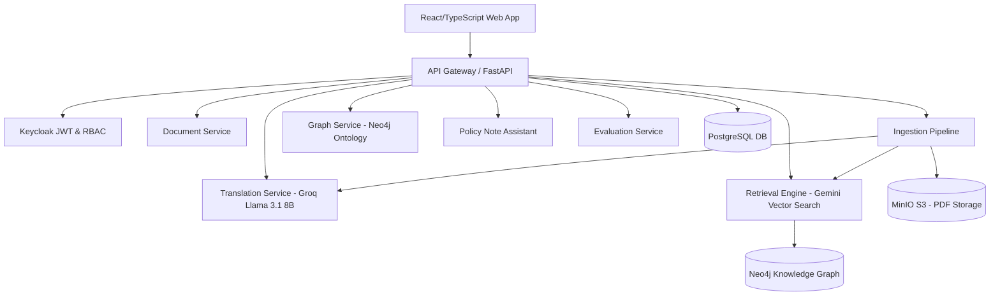

# K-FIN INTELLIGENCE — System Architecture

## Architecture Summary
- **Frontend**: React 18, TypeScript, Vite, Tailwind CSS, Lucide icons, Recharts, Cytoscape.js, PDF.js.
- **API Gateway**: FastAPI unified routing, JWT validation, rate limiting, and OpenAPI documentation.
- **Multi-Model AI Plane**:
  1. **Web-App LLM**: Configurable in Admin AI Wizard (Gemini, OpenAI, Azure, Groq).
  2. **Translation LLM**: Fixed system service running **Groq `llama-3.1-8b-instant`**.
  3. **Embedding Engine**: Fixed system service running **Gemini Embeddings (`text-embedding-004`)**.
- **Data Layer**: Neo4j (Knowledge Graph), PostgreSQL (Application State & Audit Logs), MinIO (S3 PDF Assets), Redis (Job Queue & Caching).
