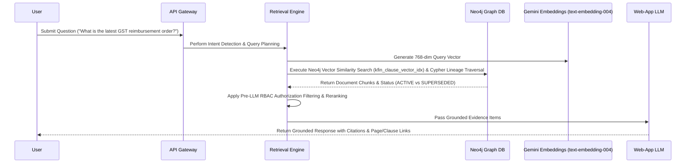

# Controlled Hybrid GraphRAG Architecture



## 📐 Vector Embedding & Index Specification

- **Embedding Model**: Gemini `text-embedding-004`
- **Vector Dimension**: 768 float values
- **Node Property**: `CLAUSE.embedding`
- **Neo4j Vector Index Name**: `kfin_clause_vector_idx`
- **Similarity Metric**: `COSINE`

### Neo4j Vector Index Creation Cypher:
```cypher
CREATE VECTOR INDEX kfin_clause_vector_idx IF NOT EXISTS
FOR (c:CLAUSE)
ON (c.embedding)
OPTIONS {
  indexConfig: {
    `vector.dimensions`: 768,
    `vector.similarity_function`: 'cosine'
  }
}
```

### Neo4j Vector Search & Lineage Retrieval Cypher:
```cypher
CALL db.index.vector.queryNodes('kfin_clause_vector_idx', 5, $query_vector)
YIELD node AS c, score
MATCH (d:DOCUMENT)-[:HAS_SECTION]->(s:SECTION)-[:HAS_CLAUSE]->(c)
OPTIONAL MATCH (d)-[:SUPERSEDES]->(old_doc:DOCUMENT)
RETURN d.document_number AS doc_number,
       d.status AS status,
       c.clause_number AS clause_number,
       c.text AS excerpt,
       score AS vector_score,
       old_doc.document_number AS superseded_doc
ORDER BY score DESC
```

## Anti-Hallucination & Security Rules
1. **Unrestricted Cypher Ban**: The LLM is NEVER allowed to execute arbitrary Cypher queries. All Cypher queries use parameterized templates registered in the Graph Service.
2. **Pre-LLM Authorization**: Document access control filters out restricted evidence before passing context to the LLM.
3. **Status Lineage Enforcement**: Document status (`ACTIVE`, `SUPERSEDED`, `AMENDED`) is resolved explicitly via Neo4j relationship chains, not inferred by year.
